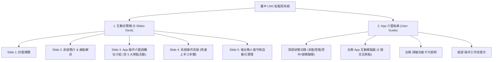

# 🚢 臺中 LNG 船監控系統簡報與使用指南對照大綱

> [!NOTE]
> 本大綱對應 `使用守則` 資料夾中的雙軌網頁資源：
> 1. **互動式簡報**：[milkshake_app_presentation.html](file:///C:/Users/hilla/Desktop/milkshake/使用守則/milkshake_app_presentation.html) (含 5 頁投影片與內嵌模擬器)
> 2. **App 介面指南**：[milkshake_app_user_guide.html](file:///C:/Users/hilla/Desktop/milkshake/使用守則/milkshake_app_user_guide.html) (側重雙欄互動式教學)
> 
> 系統核心版本：**NV4.7.5** (前端展示介面採用 NV4.7.5 互動模擬元件進行校準)

---

## 🗺️ 簡報與指南結構對照

---

## 📄 一、互動式簡報詳細大綱 (`milkshake_app_presentation.html`)

### Slide 1：封面 (Title Slide)
*   **標題**：臺中 LNG 船監控系統
*   **副標題**：透過自動化技術，輔助 LNG 船隻安全、精準地評估進港時機。
*   **徽章**：`AUTOMATION SYSTEM · NV4.7.5` (奶昔 NV4.7.5 展示版)
*   **設計風格**：深色背景，左右兩側簡潔對齊，搭配由左至右漸變進度條與微動畫。

### Slide 2：系統簡介 & 痛點解決 (Introduction & Challenges)
*   **⚠️ 核心挑戰**：
    1.  **限制風速極為嚴格**：LNG 船進港風速限值極低（180K 級為 `12.0 m/s`），風速高低是判定安全的最核心關鍵。
    2.  **人工記錄時間誤差**：傳統上依靠人工頻繁查詢氣象網站及手動抄寫記錄，容易產生時效性延遲與記錄上的時間差。
*   **💡 解決方案**：
    1.  **自動即時爬蟲**：系統每分鐘自動抓取台中港「北堤綠燈塔」第一手氣象風速，杜絕人工查詢的疏漏。
    2.  **智慧動態判定**：綜合目前風速、限速，並結合夏季 (`05:00`) / 冬季 (`05:30`) 開始判定時間，系統即時動態分析進港安全度。

### Slide 3：App 操作介面與欄位介紹 (App UI & Fields Tour)
*   **主題**：一目了然的操作介面與欄位設計。
*   **互動設計**：左側為 **App 互動模擬器**，提供三個模擬切換按鈕（`未監控狀態 standby`、`驗證密碼 modal`、`正常監控中 monitoring`）。點擊畫面中的 **熱點 (1-5)** 可觸發右側對應卡片的聚焦（Focus）高亮。
*   **欄位與控制介紹 (熱點對照)**：
    1.  **【即時風速顯示】(熱點 1)**：每分鐘自動抓取最新氣象風速，提供小數點第一位精度，並附帶資料時間。
    2.  **【動態判定狀態框】(熱點 2)**：依風速及時段自動呈現：灰色「等待進港」、黃色「無法進港」或綠色呼吸燈「安全可進港」。
    3.  **【船名與限速欄位】(熱點 3)**：啟動前輸入今日設定值。啟動後，此欄位自動鎖定（Disabled）以防止錯誤篡改。
    4.  **【控制按鈕與安全認證】(熱點 4)**：提供「開始監控」與「結束監控」切換，操作時均會觸發安全授權密碼輸入框。
    5.  **【手動 POB 時間】(熱點 5)**：結束監控前可填寫 POB 時間。系統會自動回溯前 10 分鐘內最接近的風速進行歸檔記錄。

### Slide 4：系統操作流程 (System Operation Workflow)
*   **主題**：三步驟快速上手。
*   **步驟詳解**：
    1.  **第一步：啟動監控**：於 App 介面輸入今日進港「船名」與「限制風速」➔ 點選「開始監控」➔ 輸入授權密碼認證。
    2.  **第二步：即時觀測**：網頁背景保持每分鐘更新，依判定條件動態在畫面亮起綠色呼吸燈（安全可進港）或黃色警示燈（風速超標）。
    3.  **第三步：確認 POB**：手動輸入 POB 時間或經由 LINE 機器人自動偵測 ➔ 確認結束 ➔ 系統儲存回溯風速並詢問是否預約明日監控。

### Slide 5：後台無人值守與自動化管理 (Backend & Automation)
*   **主題**：自動排程與無人值守後台。
*   **排程運作機制**：
    *   **清晨排程 (🕒 04:00)**：自動存取最新船期表。若當日有船，將啟動監控。
    *   **深夜排程 (📁 23:00)**：自動提取今日所有風速日誌與 POB 記錄。將數據自動載入至 Google Sheets 試算表中保存歸檔，最後清理 Firebase 今日快取。

---

## 📄 二、App 介面指南詳細大綱 (`milkshake_app_user_guide.html`)

### 頂部狀態切換 (Simulator State Controller)
*   **功能**：提供三個狀態快速切換按鈕，直接改變左側模擬器的 UI 呈現：
    1.  **未監控狀態**：模擬系統初始、無船隻監控時的輸入狀態。
    2.  **監控中狀態**：模擬系統啟動後，欄位鎖定、動態狀態框顯示綠色呼吸燈（例如 `Cobia 可進港`）以及 POB 記錄與手動輸入欄位出現的畫面。
    3.  **安全密碼視窗**：模擬進行敏感操作時彈出的密碼輸入框。

### 左側 App 互動模擬器 (Interactive Simulator)
*   模擬真實 App 的視覺排版：
    *   **標題列**：`🚢臺中LNG船監控`
    *   **風速顯示區**：大字體數值 + `m/s` + 更新時間。
    *   **動態狀態框**：
        *   等待狀態：`等待啟動監控` (灰色 `app-status-waiting` 樣式)
        *   安全狀態：`船名 可進港` (綠色 `app-status-safe` 樣式 + 呼吸燈陰影動畫)
        *   超標狀態：`無法進港` (黃色 `app-status-warning` 樣式)
    *   **輸入框**：船名（text）、限制風速（number）、手動輸入 POB 時間（text）。
    *   **控制按鈕**：開始監控 / 結束監控。
    *   **POB 歷史面板**：顯示當日已 POB 船隻的歸檔風速資訊。
    *   **熱點 (Hotspots)**：半透明圓形圓點 (1-5)，點擊時會使右側對應的說明卡片自動滑動並點亮。

### 右側 詳細功能卡片說明 (Interactive Guide Cards)
*   **1. 【即時風速顯示】**：擷取自北堤綠燈塔，保障最新氣象數據。
*   **2. 【動態判定框】**：自動判定並以不同顏色呼吸燈提示。
*   **3. 【輸入欄位】**：提供啟動時的基本參數設定，啟動後唯讀保護。
*   **4. 【控制按鈕】**：提供防誤觸的安全密碼驗證。
*   **5. 【手動 POB 時間】**：介紹系統的「智慧自動回溯」機制，能自動定位 POB 前 10 分鐘內的最適風速。

### 底部 操作工作流提示 (Bottom Workflow Bar)
*   提供橫向三欄式的新手教學：**第一步：啟動監控** ➔ **第二步：即時監控中** ➔ **第三步：確認 POB 結束**。

---

## 🎯 系統版本演進備忘 (NV4.7.3 → NV4.7.5 更新整合)

在向使用者進行簡報或教學時，應補充說明 **NV4.7.3 → NV4.7.5** 進化機制（已整合至程式中）：

### NV4.7.3 核心機制
1.  **日曆更新最高優先權**：每日 04:00 自動啟動時，若日曆有當日船活動，會自動取消前一日手動預約，改以日曆為準。
2.  **Firebase 實時同步船期表**：日曆變更或狀態異動時，後端即時推播至 Firebase `schedule_list`，前端看板免整理秒速加載。
3.  **雙軸容錯 (GAS Fallback)**：當 Firebase 讀取受限時，前端會自動降級請求 GAS API 船期，確保監控不中斷。

### NV4.7.5 新增功能（此版主要更新）
1.  **🔔 音效鈴鐺系統**：船期表標題列新增鈴鐺按鈕，預設關閉，僅在監控中出現於「船期表標題」與「手動設定齒輪」中間。
    -   使用者可手動點擊鈴鐺開啟音效 (🔔 關→ 🔔 開)。
    -   符合進港條件時，音效持續循環播放水晶風鈴聲 (約 12 秒循環)。
    -   若不需要提醒，再次點擊鈴鐺按鈕即可關閉音效。
    -   音效會一直持續到收到 LINE POB 訊息或手動結束監控為止。
2.  **版本徽章更新**：封面標識徽章更新為 `AUTOMATION SYSTEM · NV4.7.5`。
3.  **音效資源**：`notification_option_C.mp3` (現代科技木琴)，循環約 5 秒。
