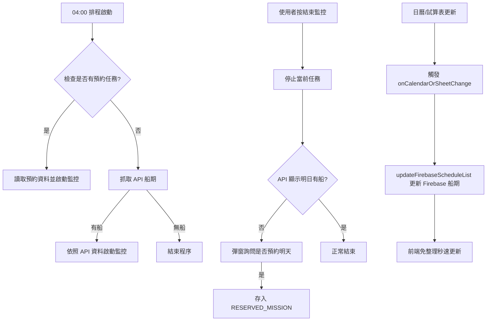

# 🚢 臺中 LNG 船監控系統 (奶昔監控) - NV4.7.3

這是一個整合 **Google Apps Script (GAS)**、**Firebase Realtime Database**、**LINE Bot** 與響應式 Web 前端的一體化自動化監控與歸檔系統，專為臺中港 LNG 船進港風速判定與數據歸檔而設計。

## 📋 系統架構
* **前端監控看板 (index.html / index_NV4.7.3.html)**：提供即時風速顯示、呼吸燈狀態提示、手動控制開關、即時同步船期表與系統介紹連結。
* **後端核心邏輯 (gs_NV4.7.3.js)**：執行於 Google Apps Script (V8 引擎)，負責爬取風速、邏輯判定、Firebase 實時同步、LINE 訊息解析、Google Drive 自動備份與排程。
* **資料中心 (Firebase Realtime Database)**：作為即時數據傳輸的中繼站，提供毫秒級的狀態與船期同步。
* **報表中心 (Google Spreadsheet)**：每日深夜自動將監控紀錄歸檔至指定雲端試算表。

---

## ⚙️ 程式運作邏輯

### 1. 核心監控流程
1.  **啟動機制**：
    * **自動**：每日 04:00 執行 `checkDailySchedule`。
        * **優先權**：若有「手動預約」任務（讀取 `RESERVED_MISSION`），則優先啟動。
        * **API**：若無預約，則透過 API 抓取明日船期，有船則啟動。
    * **手動**：使用者透過網頁輸入船名與限制風速，點擊「開始監控」啟動。
2.  **資料抓取**：每 1 分鐘由 GAS 爬取指定測站（如台中港北堤）的即時風速，並推播至 Firebase。
3.  **狀態判定**：
    * **等待期**：目前時間未到「表定判定時間」前，顯示灰色等待狀態。
    * **判定中**：時間到達後，若 `目前風速 > 限制風速` 顯示**紅燈警告**；反之則顯示**綠燈安全**（呼吸燈效果）。

### 2. 實時船期同步與雙軌備用機制 (NV4.7.3 新增)
* **實時推送**：當後端偵測到狀態異動、手動修改或日曆/試算表變更時，會自動調用 `updateFirebaseScheduleList()`，將最新船期即時寫入 Firebase 的 `/schedule_list` 節點。前端網頁透過 Firebase 連線監聽，達到免整理、毫秒級的船期載入，極大節省 GAS 存取額度。
* **安全規則限制**：Firebase Realtime Database 需開放 `/schedule_list` 節點的公開讀取權限 (`.read: true`, `.write: false`)。
* **雙軌容錯 (GAS Fallback)**：若 Firebase 讀取受限（如權限未開啟或遭遇 `401 Unauthorized`），前端 `index_NV4.7.3.html` 會自動降級調用 GAS API 接口 (`action=display`) 獲取船期，確保系統運作不中斷。

### 3. 預約監控機制 (接力模式)
當手動點擊「結束監控」時，系統會自動檢查隔日 API 船期。若 API 查無資料，網頁會彈窗詢問：「**明日是否繼續監控 [目前船名]？**」。
* **確認預約**：系統將目前的「船名」與「速限」存入 GAS 內部屬性 (`RESERVED_MISSION`)。
* **隔日執行**：次日 04:00 排程會讀取此預約，強制啟動監控，確保監控不中斷。
* **安全認證**：不論是「啟動監控」還是「結束並預約」，皆需經過 `OP_PASSWORD` 密碼驗證。

### 4. 執行流程圖


### 5. 關鍵時間點判定 
系統會依據月份自動切換判定啟動時間：
* **夏季 (4月 - 9月)**：**05:00** 開始判定（提早 30 分鐘判斷是否可進港）。
* **冬季 (10月 - 3月)**：**05:30** 開始判定（提早 30 分鐘判斷是否可進港）。

### 6. POB 時光機邏輯
當 LINE Bot 收到 POB 訊息（例如：`台中廠: XXX 船已於 08:10 POB`）：
1.  自動從 Firebase 的 `wind_logs` 歷史紀錄中尋找與 08:10 最接近的風速值（誤差 10 分鐘內）。
2.  將匹配到的風速紀錄於看板，並自動切換 App 為停止監控模式。

---

## 🚀 使用者操作與維護說明

### 網頁介面操作
1.  **查看即時資訊**：頁面中央顯示目前測站的**即時風速**與**最後更新時間**。
2.  **系統功能與操作介紹**：標題下方設有跳轉連結，可直達部署在 `/presentation/` 下的互動式簡報。
3.  **手動啟動監控**：
    * 點擊船期表右側的「設定」齒輪圖標，輸入密碼解鎖。
    * 在「船名」欄位輸入名稱（例：Cobia LNG）。
    * 在「限制風速」欄位輸入數值（例：12.0）。
    * 按下 **▶ 開始監控**。此時輸入框會鎖定，系統開始運作。
4.  **手動結束監控**：
    * 監控完成後（或需更正資訊），點擊 **⏹ 結束監控** 即可解除鎖定並清除當前狀態。
5.  **POB 紀錄板**：頁面底部會顯示今日所有已 POB 的船隻資訊與對應風速。

### 雲端部署與自動化備份
#### 1. Clasp 本地部署
專案目錄已整合 `clasp`。在本機命令列執行以下指令可直接推送更新至 GAS 雲端：
```powershell
# 推送本機程式碼至 GAS 雲端
clasp push
```

#### 2. Google Drive 自動化備份
利用 `clasp` 的授權憑證，系統會直接調用 Google Drive REST API 將核心檔案 `gs_NV4.7.3.js` 與 `index.html` 備份上傳至指定雲端硬碟資料夾中（Folder ID: `1YigsC5N6QLlthHUJ3WOTIJ8tyyi03fYw`），免去手動備份的繁瑣。

### 後端維護與設定 (GAS)
1.  **Script Properties (指令碼屬性)**：
    請確保 GAS 專案中設定了以下必要屬性：
    * `FIREBASE_URL`: Firebase 資料庫網址。
    * `FIREBASE_SECRET`: Firebase 認證金鑰。
    * `TARGET_URL`: 風速資料來源網址。
    * `SPREADSHEET_ID`: 歸檔用的 Google 試算表 ID。
    * `OP_PASSWORD`: 用於前端啟動與結束的密碼核對。
2.  **自動排程**：
    * 執行一次 `setupSystemTriggers()` 函數，系統會自動建立 04:00 抓船期、每分鐘監控、23:00 歸檔的觸發器。
    * **即時同步觸發器**：設定當關聯的 Google 日曆或試算表有變更時，自動調用 `onCalendarOrSheetChange` 以即時推送最新船期。

---

## 📊 數據歸檔
每日 23:00，系統會執行 `archiveAndClearFirebase`：
* 將今日所有船隻的「船名、限速、POB 時間、POB 風速、全天風速日誌」寫入試算表中的 **「歸檔總表」** 工作表。
* 清理 Firebase 資料庫，為隔日監控做準備。

---

## 🛠 技術規格
* **前端**：HTML5, CSS3 (Flexbox/Animation), JavaScript (Vanilla JS).
* **資料庫**：Firebase Realtime Database REST API / Real-time Sync.
* **後端**：Google Apps Script (V8 Engine).
* **工具**：Clasp (Command Line Apps Script Projects).
* **整合**：LINE Messaging API (Webhook).
