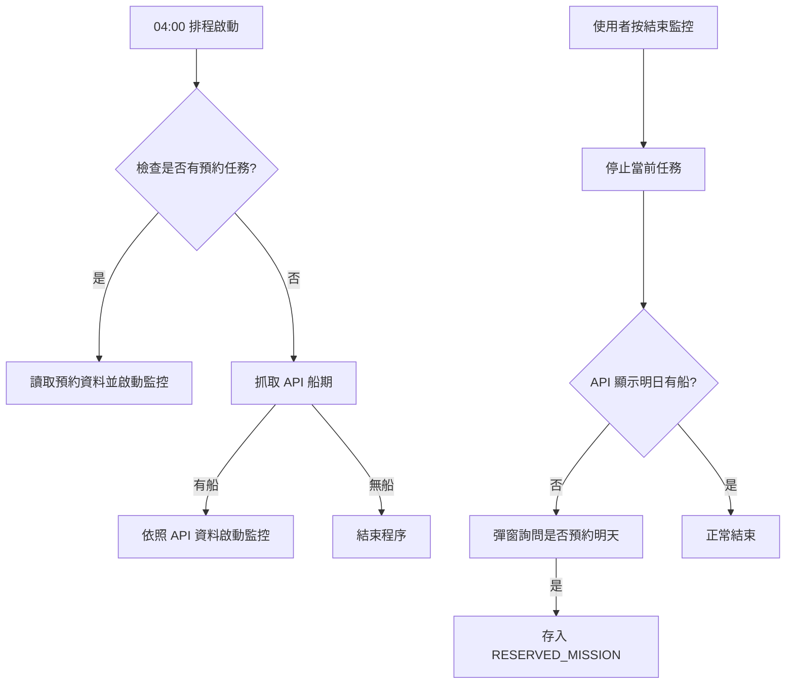

# 🚢 臺中 LNG 船監控系統 (奶昔監控) - 2026/03/27

這是一個整合 **Google Apps Script (GAS)**、**Firebase Realtime Database** 與 **LINE Bot** 的全方位自動化監控系統，專為臺中 LNG 船進港風速判定與數據歸檔而設計。

## 📋 系統架構
* **前端介面 (index NV4.6.3.html)**：提供即時風速顯示、呼吸燈狀態提示與手動控制開關。
* **後端引擎 (NV4.6.5.js)**：執行於 Google Apps Script，負責爬取風速、邏輯判定、LINE 訊息解析與自動排程。
* **資料中心 (Firebase)**：作為即時數據傳輸的中繼站，確保網頁與後端同步零延遲。
* **報表中心 (Google Spreadsheet)**：每日深夜自動將監控紀錄歸檔至試算表。

---

## ⚙️ 程式運作邏輯

### 1. 核心監控流程
1.  **啟動機制**：
    * **自動**：每日 04:00 執行 `checkDailySchedule`。
        * **優先權**：若有「手動預約」任務，則優先啟動。
        * **API**：若無預約，則透過 API 抓取船期，有船則啟動。
    * **手動**：使用者透過網頁輸入船名與限制風速，點擊「開始監控」。
2.  **資料抓取**：每 1 分鐘由 GAS 爬取指定測站的即時風速，並推播至 Firebase。
3.  **狀態判定**：
    * **等待期**：目前時間未到「表定判定時間」前，顯示灰色等待狀態。
    * **判定中**：時間到達後，若 `目前風速 > 限制風速` 顯示**紅燈警告**；反之則顯示**綠燈安全**（呼吸燈效果）。

### 2. 預約監控機制 (接力模式)
當手動點擊「結束監控」時，系統會自動檢查隔日 API 船期。若 API 查無資料，網頁會彈窗詢問：「**明日是否繼續監控 [目前船名]？**」。
* **確認預約**：系統將目前的「船名」與「速限」存入 GAS 內部屬性 (`RESERVED_MISSION`)。
* **隔日執行**：次日 04:00 排程會讀取此預約，強制啟動監控，確保監控不中斷。

### 3. 執行流程圖

### 4. 關鍵時間點判定 
系統會依據月份自動切換判定啟動時間：
* **夏季 (4月 - 9月)**：**05:00** 開始判定（提早 30 分鐘判斷是否可進港）。
* **冬季 (10月 - 3月)**：**05:30** 開始判定（提早 30 分鐘判斷是否可進港）。

### 5. POB 時光機邏輯
當 LINE Bot 收到 POB 訊息（例如：`台中廠: XXX 船已於 08:10 POB`）：
1.  自動從 Firebase 的 `wind_logs` 歷史紀錄中尋找與 08:10 最接近的風速值（誤差 10 分鐘內）。
2.  將匹配到的風速紀錄於看板，並自動切換 App 為停止監控模式。

---

## 🚀 使用者操作說明

### 網頁介面操作
1.  **查看即時資訊**：
    * 頁面中央顯示目前測站的**即時風速**與**最後更新時間**。
2.  **手動啟動監控**：
    * 在「船名」欄位輸入名稱（例：Cobia LNG）。
    * 在「限制風速」欄位輸入數值（例：12.0）。
    * 按下 **▶ 開始監控**。此時輸入框會鎖定，系統開始運作。
3.  **手動結束監控**：
    * 監控完成後（或需更正資訊），點擊 **⏹ 結束** 即可解除鎖定並清除當前狀態。
4.  **POB 紀錄板**：
    * 頁面底部會顯示今日所有已 POB 的船隻資訊與對應風速。

### 後端維護與設定 (GAS)
1.  **Script Properties (指令碼屬性)**：
    請確保 GAS 專案中設定了以下必要屬性：
    * `FIREBASE_URL`: Firebase 資料庫網址。
    * `FIREBASE_SECRET`: Firebase 認證金鑰。
    * `TARGET_URL`: 風速資料來源網址。
    * `SPREADSHEET_ID`: 歸檔用的 Google 試算表 ID。
2.  **自動排程**：
    * 執行一次 `setupSystemTriggers()` 函數，系統會自動建立 04:00 抓船期、每分鐘監控、23:00 歸檔的觸發器。

---

## 📊 數據歸檔
每日 23:00，系統會執行 `archiveAndClearFirebase`：
* 將今日所有船隻的「船名、限速、POB 時間、POB 風速、全天風速日誌」寫入試算表中的 **「歸檔總表」** 工作表。
* 清理 Firebase 資料庫，為隔日監控做準備。

---

## 🛠 技術規格
* **前端**：HTML5, CSS3 (Flexbox/Animation), JavaScript (Vanilla JS).
* **資料庫**：Firebase Realtime Database REST API.
* **後端**：Google Apps Script (V8 Engine).
* **整合**：LINE Messaging API (Webhook).

