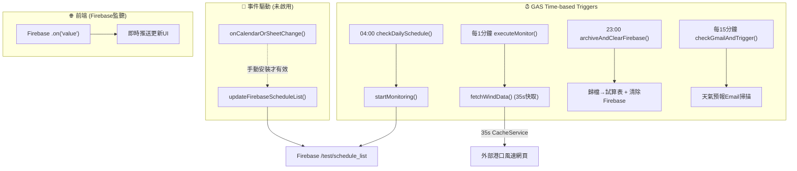
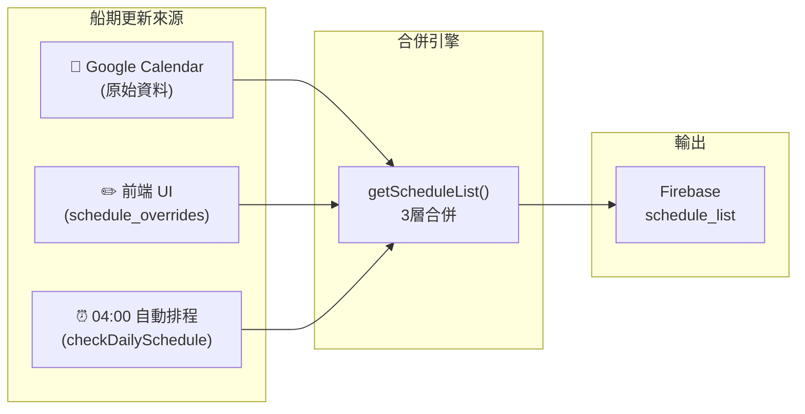
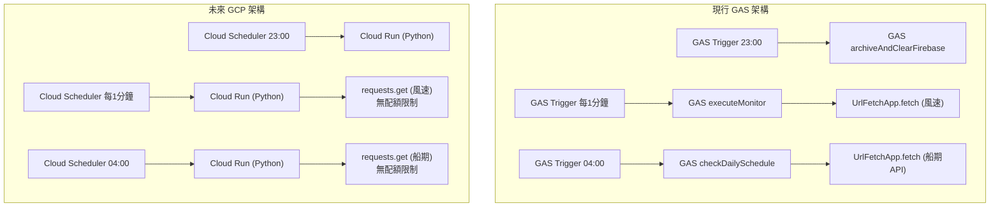

# 草稿區 5 項議題 — 深度技術分析報告

> 基於 [gs_test.js](C:/Users/hilla/Desktop/奶昔code/測試版/gs_test.js)、[index_test.html](C:/Users/hilla/Desktop/奶昔code/測試版/index_test.html) 與 [移轉規劃書](C:/Users/hilla/Desktop/奶昔code/docs/移轉規劃書.md) 的全面研讀
> 討論日期：2026-06-22

---

## 📌 現行架構快照（討論基礎）



---

## 議題 1️⃣：新增日曆觸發器 `onCalendarOrSheetChange()`

### 現狀分析

代碼中 **已存在** `onCalendarOrSheetChange()` 函式（[L1372-L1375](C:/Users/hilla/Desktop/奶昔code/測試版/gs_test.js#L1372-L1375)），但它：
- ❌ **未被 `setupSystemTriggers()` 自動安裝**（L1346-1354 只安裝了 4 個觸發器）
- ❌ 需要手動到 GAS 編輯器設定 installable trigger
- ✅ 功能本身很簡單：就是呼叫 `updateFirebaseScheduleList()`

### 可行性：✅ 高度可行

Google Calendar 支援 **Installable Calendar Trigger**，當指定日曆的事件被建立/修改/刪除時，GAS 會在幾秒內自動被喚醒執行。

### 實作方式

```javascript
// 在 setupSystemTriggers() 中新增：
ScriptApp.newTrigger('onCalendarOrSheetChange')
  .forUserCalendar('你的日曆Email@gmail.com')  // 或 Calendar ID
  .onEventUpdated()
  .create();
```

### 優點

| 優點 | 說明 |
|---|---|
| **即時性** | 日曆修改後幾秒內 Firebase 船期表即自動更新，前端透過 `.on('value')` 立刻收到推送 |
| **零成本** | 不消耗 UrlFetch 配額（Calendar trigger 是 Google 內部事件，不算 HTTP 請求） |
| **降低延遲** | 現行方式要等 `doGet(display)` 的 5 分鐘冷卻過期才會同步，日曆觸發器可以秒級同步 |
| **簡化流程** | 船期管理員只要改日曆，系統就自動更新，不需要手動進前端操作 |

### 風險與注意事項

| 風險 | 等級 | 說明 |
|---|---|---|
| 連環觸發 | ⚠️ 中 | 如果管理員短時間內連改多筆日曆事件，每筆都會觸發一次 `getScheduleList()` → `UrlFetchApp.fetch(船期日曆API)`。建議加入 **10~15 秒防抖 (debounce)**，用 CacheService 標記「最近已同步」 |
| 日曆 ID 綁定 | ⚠️ 低 | `forUserCalendar()` 需要綁定特定日曆，如果換日曆就需要重建觸發器 |
| 觸發器配額 | ⚠️ 低 | 每個使用者最多 20 個 installable triggers，目前用 4 個，還有充裕空間 |
| 現行邏輯影響 | ✅ 無 | 它只是多了一個「主動呼叫 `updateFirebaseScheduleList()`」的來源，不影響任何現有流程 |

### 🎯 第一次建議

**直接啟用**，風險極低。建議加入防抖邏輯：

```javascript
function onCalendarOrSheetChange() {
  const cache = CacheService.getScriptCache();
  if (cache.get('calendar_sync_debounce')) return; // 15秒內已同步過
  cache.put('calendar_sync_debounce', 'true', 15);
  updateFirebaseScheduleList();
}
```

---

## 議題 2️⃣：是否刪除「5 分鐘冷卻機制」

### 現狀分析

系統中存在 **兩個獨立的冷卻/快取機制**，必須分開討論：

| 機制 | 位置 | 觸發場景 | 冷卻時間 | 保護對象 |
|---|---|---|---|---|
| **A. 風速爬取快取** | [fetchWindData() L1077-L1114](C:/Users/hilla/Desktop/奶昔code/測試版/gs_test.js#L1077-L1114) | `executeMonitor()` 每1分鐘 | **35 秒** (CacheService) | 外部港口網頁 + GAS UrlFetch 配額 |
| **B. 船期同步冷卻** | [doGet() L1055-L1067](C:/Users/hilla/Desktop/奶昔code/測試版/gs_test.js#L1055-L1067) | 前端載入頁面 (`display`) | **5 分鐘** (ScriptProperties) | 船期日曆 API + Firebase 寫入次數 |

### 分析：機制 A（風速 35 秒快取）— ⛔ 絕對不能刪

> [!CAUTION]
> 此機制是 GAS 配額的最後防線，刪除將導致系統崩潰風險。

- `executeMonitor()` 每 1 分鐘由 GAS 觸發器執行一次
- 若無 35 秒快取，每次都會 `UrlFetchApp.fetch()` 爬外部港口網頁
- 一天 04:00~17:30 = 810 分鐘 → 810 次 UrlFetch（僅此一項）
- 加上其他 API 呼叫（Firebase 讀寫、船期 API、GitHub API），每日配額 20,000 次看似充裕，但：
  - **多人同時在線的前端 `display` 請求** 也消耗 UrlFetch
  - 未來若正式版也用同一 GAS，配額共享
- **結論：必須保留，是 GEMINI.md 規則明文要求的防護措施**

### 分析：機制 B（船期 5 分鐘冷卻）— ✅ 可以刪除（如果啟用議題 1 的日曆觸發器）

> [!TIP]
> 如果日曆觸發器已啟用，此機制變得多餘甚至有害。

**現行問題：**
- 管理員在 Google Calendar 修改船期後，前端使用者重新整理頁面，仍要等最多 5 分鐘才能看到更新
- 但前端已經透過 **Firebase `.on('value')` 即時監聽** `test/schedule_list`，根本不需要走 `doGet(display)` 這條路
- `doGet(display)` 只是「備用路徑」（Firebase 讀取失敗時才用）

**若日曆觸發器啟用後的新流程：**
```
日曆修改 → (秒級) onCalendarOrSheetChange() → updateFirebaseScheduleList()
         → Firebase /test/schedule_list 更新
         → 前端 .on('value') 自動推送 → UI 即時更新
```

`doGet(display)` 的 5 分鐘冷卻在此流程下幾乎不會被觸發。但為了安全考量：

### 🎯 第一次建議

- **不直接刪除代碼**，而是將冷卻從 5 分鐘**降至 1 分鐘**
- 這樣 `display` 備用路徑仍然有防護，但延遲大幅降低
- 搭配日曆觸發器，正常情況下根本不會走到這條路

---

## 議題 3️⃣：可行性與風險評估（避免現行邏輯失靈）

### 現行船期調整有 3 個入口，必須全部保持運作：



### 風險矩陣

| 修改項目 | 對 checkDailySchedule 的影響 | 對 executeMonitor 的影響 | 對前端 UI 的影響 | 對歸檔的影響 |
|---|---|---|---|---|
| 啟用日曆觸發器 | ✅ 無影響 | ✅ 無影響 | ✅ 更快看到更新 | ✅ 無影響 |
| 降低 display 冷卻 | ✅ 無影響 | ✅ 無影響 | ✅ 備用路徑更快 | ✅ 無影響 |
| 刪除 35s 風速快取 | ✅ 無影響 | ⛔ 配額風險 | ✅ 無影響 | ✅ 無影響 |

### 關鍵防護：不要動以下邏輯

1. **`getScheduleList()` 的 3 層合併順序**（日曆 → overrides → 過濾）
2. **`ensureTestEnvironment()` 的環境隔離**
3. **`tryHandoffToNextShip()` 的換班接力邏輯**
4. **`executeMonitor()` 的 17:30 自動停止**
5. **`schedule_source === 'manual'` 的手動模式支援**

---

## 議題 4️⃣：23:00 歸檔 + 04:00 啟動 觸發器合併

### 現狀

| 觸發器 | 時間 | 執行內容 | 耗時 |
|---|---|---|---|
| `archiveAndClearFirebase()` | 23:00 | 歸檔到試算表 + 船期繼承 + 清除 Firebase + 重置 active_status | 重（大量讀寫 Sheets + Firebase） |
| `checkDailySchedule()` | 04:00 | 讀船期 → 找今天的船 → startMonitoring | 輕（1-2 次 API 呼叫） |

### 合併可行性分析

**方案 A：23:00 歸檔完畢後立即執行隔天排程** ❌ 不建議

| 問題 | 說明 |
|---|---|
| 日曆可能還沒更新 | 23:00 時隔天的船期可能還沒確定，調度員可能在凌晨才更新日曆 |
| 跨日日期問題 | `getScheduleList()` 用「今天的日期」比對船期，23:00 執行時「今天」和「隔天 04:00 的今天」不同 |
| 歸檔失敗風險 | 若歸檔步驟 throw error，後續排程也會被波及 |

**方案 B：合併為單一函式但保持兩個觸發時間** ⚠️ 意義不大

- 兩個函式完全獨立，邏輯沒有重疊
- 合併反而增加複雜度與出錯風險

**方案 C：微調時間但保持獨立** ✅ 可考慮

- 23:00 歸檔 → 維持不變
- 04:00 啟動 → 可微調至 03:50 或 04:10，視需求而定
- 但目前 04:00 已經運作良好，沒有實際痛點

### 🎯 建議

**不合併**。理由：
1. 兩個函式職責完全不同（一個是「收尾」，一個是「開場」）
2. 時間間隔 5 小時（23:00 → 04:00），期間日曆數據可能變動
3. 合併的代價（增加複雜度）遠大於收益（少一個觸發器）
4. 現行獨立運作穩定，**不要修沒壞的東西**

> [!NOTE]
> 如果未來移轉到 GCP Cloud Scheduler（Step 3~5），每個 Cron Job 都是獨立的，合併更沒意義。GCP 前 3 個 Cron Job 免費，目前 4 個觸發器都搬過去也只花約 $0.10/月。

---

## 議題 5️⃣：移轉 Python / GCP 的費用與邏輯分析

### 現行 GAS 架構的瓶頸

| 限制 | 額度 | 現行消耗估算 | 風險等級 |
|---|---|---|---|
| UrlFetch 次數 | 20,000/天 | ~2,000-4,000/天 (單人使用) | ⚠️ 中（多人同時使用時可能倍增） |
| 總執行時間 | 90 分鐘/天 | ~30-45 分鐘/天 (監控日) | ⚠️ 中 |
| 單次執行時間 | 6 分鐘/次 | 歸檔可能接近 | ⚠️ 中 |
| CacheService | 100 KB/條目 | 風速 JSON << 100KB | ✅ 低 |
| Triggers 數量 | 20 個/使用者 | 用了 4~5 個 | ✅ 低 |

### Python + GCP Cloud Run 架構對比



### 費用預估 (移轉規劃書數據)

| 項目 | GAS 方案 (Step 2) | GCP 方案 (Step 3~5) |
|---|---|---|
| 月費 | **$0.00** | **$0.00 ~ $3.00 USD** |
| 前端 | Firebase Hosting (免費) | Firebase Hosting (免費) |
| 後端 | GAS (免費) | Cloud Run (200萬次/月免費) |
| 排程 | GAS Triggers (免費) | Cloud Scheduler (前3個免費, 第4個起 $0.10/月) |
| 風速爬取限制 | 20,000次/天上限 | **無上限** |
| 執行時間限制 | 90分鐘/天 + 6分鐘/次 | **無上限** (按用量計費但極低) |

### 從 5 個角度評估是否現在啟動移轉

| 角度 | 評估 | 結論 |
|---|---|---|
| **費用** | GCP 方案月費 $0~3，與 GAS 幾乎相同 | ✅ 費用不是障礙 |
| **運作邏輯** | Python 可 1:1 對應 GAS 邏輯，且 `requests` 庫更穩定 | ✅ 邏輯可無損移植 |
| **配額自由度** | GCP 無 UrlFetch 配額限制，可移除 35s 快取 | ✅ 架構更乾淨 |
| **開發成本** | 需重寫 1574 行 GAS → Python，加上部署/測試 | ⚠️ 工作量大 |
| **時機** | Step 2 測試版剛部署完成，需要先觀察穩定度 | ⚠️ 不急 |

### 🎯 建議

**遵循移轉規劃書的漸進策略**：

1. **現在 (Step 2)**：先做議題 1 和 2 的 GAS 優化（日曆觸發器 + 冷卻調整），幾乎零風險
2. **觀察 1~2 個月**：確認 Firebase Hosting + GAS 後端的穩定度
3. **再啟動 Step 3**：用 Python 重寫時，可以直接去掉冷卻機制（因為 Cloud Run 無配額限制）

> [!IMPORTANT]
> 在 GAS 架構下做的優化（日曆觸發器、防抖邏輯）不會白費。移轉到 GCP 後：
> - 日曆觸發器 → 改用 **Google Calendar Push Notifications (Webhook)** 或 **Pub/Sub**
> - 5 分鐘冷卻 → 直接移除
> - 35 秒風速快取 → 直接移除（或降為 Redis 秒級快取做去重）

---

## 🏁 第一次總結建議 (2026-06-22 20:37)

| 議題 | 建議 | 優先級 | 風險 |
|---|---|---|---|
| 1. 日曆觸發器 | ✅ **啟用**，加 15 秒防抖 | 🔴 高 | 極低 |
| 2. 刪除冷卻機制 | ⚠️ **不刪 35s 風速快取**；5 分鐘船期冷卻降至 1 分鐘 | 🟡 中 | 低 |
| 3. 避免邏輯失靈 | ✅ 以上修改不影響任何現行關鍵流程 | — | — |
| 4. 合併觸發器 | ❌ **不合併**，保持獨立更安全 | ⚪ 低 | 合併反而有風險 |
| 5. 移轉 Python/GCP | ⏳ **先觀察**，待 Step 2 穩定後再啟動 | ⚪ 低 | 時機未到 |

**建議立即可做的修改：議題 1（啟用日曆觸發器 + 防抖）+ 議題 2（船期冷卻降至 1 分鐘）**
預估影響：~10 行代碼修改，零風險，即時效果。

---

## 🔄 第二次討論 — 使用者回饋與修正 (2026-06-22 21:28)

使用者針對第一次分析提出回饋，以下為逐項回應與最終結論：

### 使用者回饋 1：為何降冷卻到 1 分鐘？會增加次數嗎？

**回應：**

5 分鐘冷卻只在前端走 `doGet(action=display)` 備用路徑時才觸發。而正常情況下，前端是透過 **Firebase `.on('value')` 即時監聽** `test/schedule_list`，根本不走 `display` 路徑。

日曆觸發器啟用後，`display` 備用路徑被使用的機會**幾乎為零**。冷卻時間不管是 5 分鐘還是 1 分鐘，**實際上都不會被觸發**，次數不會增加。

**結論：5 分鐘冷卻直接保持不動，改了也沒有實際收益。**

### 使用者回饋 2：不需要防抖 (debounce)

**回應：**

完全同意。實務上船期調整不會在幾秒內連續修改多筆日曆事件，`onCalendarOrSheetChange()` 保持目前的簡潔寫法即可：

```javascript
function onCalendarOrSheetChange() {
  updateFirebaseScheduleList();  // 就這樣，不加防抖
}
```

### 使用者回饋 3：已手動在 GAS 編輯器設定好觸發器

日曆觸發器已透過 GAS 編輯器手動設定完成，無需修改 `setupSystemTriggers()` 代碼。

---

## ✅ 最終結論 (2026-06-22 21:28)

| 議題 | 最終決定 | 代碼修改 |
|---|---|---|
| 1. 日曆觸發器 | ✅ **已完成** — 使用者已手動在 GAS 設定 | **不需要** |
| 2. 防抖 (debounce) | ❌ **不需要** — 實務上不會短時間連續改日曆 | **不需要** |
| 3. 5 分鐘船期冷卻 | ✅ **維持不動** — 日曆觸發器啟用後此路徑幾乎不被觸發 | **不需要** |
| 4. 35 秒風速快取 | ✅ **維持不動** — GAS 配額防線，必須保留 | **不需要** |
| 5. 合併觸發器 | ❌ **不合併** — 保持獨立更安全 | **不需要** |
| 6. 移轉 Python/GCP | ⏳ **先觀察** — 待 Step 2 穩定後再啟動 | **不需要** |

> [!NOTE]
> 整個草稿區 5 項議題的最終結果：**日曆觸發器已手動設定完成、代碼零修改**。
> 原本的架構設計已經足夠穩健，不需要額外調整。
