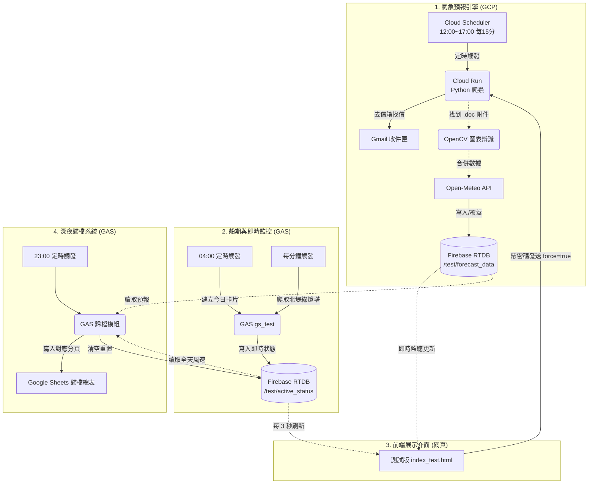

# 🚢 2026-6-27 測試版全新架構與運作邏輯總覽 (GCP 搬遷版)

**撰寫日期：** 2026-06-27  
**核心目標：** 重勞力（爬蟲、解碼、AI辨識）全面轉交 GCP 無伺服器運算，輕任務（監聽、即時狀態）交給 Google Apps Script (GAS)，並將兩端資料統一匯流至 Firebase，實現極速、穩定、零延遲的前後端分離架構。

---

## 1. 架構全景圖解

---

## 2. 模組運作邏輯解析

### ☁️ 模組 A：氣象預報與資料融合 (GCP 負責)
本模組完全由部署在 GCP 上的 Cloud Run 容器負責執行，不消耗任何 GAS 額度。
* **觸發機制**：
  1. **排程觸發**：Cloud Scheduler 每天 12:00 到 17:00 之間，每 15 分鐘去敲一次 Cloud Run。
  2. **手動觸發**：網頁端輸入正確密碼並按下「強制更新」時，會發送帶有 `?force=true` 的 HTTP 請求給 Cloud Run。
* **智慧略過 (Smart Skipping)**：
  Cloud Run 醒來第一件事，會花 0.1 秒向 Firebase 確認 `forecast_metadata.json` 中紀錄的「最後更新時間」是否為今天。如果是，就直接回傳 200 並休眠，避免重複去 Gmail 收信與消耗運算。
* **外部 API 參數 (Open-Meteo)**：
  除了抓取空軍的 `.doc`，腳本會同時透過 `src/data_fusion.py` 向 Open-Meteo 獲取 ECMWF 的陣風預測，其參數設定如下：
  * **座標**：預設為 `24.299799, 120.486499` (從 `config.json` 讀取，位於台中港區)
  * **預測模型**：`models=ecmwf_ifs` (指定使用最精準的歐洲中期天氣預報中心模型)
  * **目標資料**：`hourly=wind_gusts_10m` (10公尺陣風)
  * **單位與時區**：`wind_speed_unit=ms` (公尺/秒)，`timezone=Asia/Taipei`
* **寫入資料庫**：
  爬取與融合完成後，使用 HTTP `PUT` 請求直接將結果**「完全覆蓋」**至 Firebase 的 `test/forecast_data`。

### ⚡ 模組 B：即時監控與船期表 (GAS 負責)
保留 GAS 執行輕量、即時的工作。
* **04:00 新建任務 (`checkDailySchedule`)**：
  每天清晨向船期 API 獲取今日船隻，如果有 W12 碼頭的 LNG 船則優先排序。並在 Firebase 上產生今日專屬的 `target_key` 卡片。
* **每分鐘心跳 (`executeMonitor`)**：
  全天候每 1 分鐘抓取「北堤綠燈塔」網頁。若系統處於「監控中」狀態，會將當下風速附加寫入 `test/active_status` 的 `wind_logs`，並在前端網頁上跳動更新。

### 📦 模組 C：深夜歸檔系統 (GAS 負責)
* **23:00 收尾 (`archiveAndClearFirebase`)**：
  在 POB 結束後，系統於 23:00 自動收網。
  它會到 Firebase 撈取今天累積的：(1) POB 進港時間 (2) 1分鐘的詳細風力日誌 (3) 從 `forecast_data` 撈取當天空軍與 ECMWF 預報。
  接著將所有雜亂的 JSON 整理成乾淨格式，寫入 Google Sheets 的「歸檔總表」。若風速限制為 12.0 或 13.8，還會自動抄寫到對應的 `180K` / `160K` 分頁。歸檔成功後，將 Firebase 清空，完美結束一天。

---

## 3. 資安與保護機制總結
1. **密碼驗證前置**：測試版的前端強制更新按鈕，加入了自訂密碼驗證 (與原本的 `OP_PASSWORD` 共用邏輯)，若密碼不符，Cloud Run 會直接回絕請求 (`401 Unauthorized`)，防止對外 API 被惡意刷爆。
2. **零金鑰外洩**：所有重要密碼與 Secret (包含 Gmail、Firebase) 均存放在不被 Git 追蹤的 `.gitignore` 名單中 (`config.json`)。前端網頁 `index_test.html` 是完全去識別化的，僅使用公開讀取規則或代理，不包含任何後端金鑰。
3. **無損生產環境**：在 `data_fusion.py` 中，我們針對 Cloud Run 環境 (具有 `FIREBASE_RTDB_PREFIX=/test`) 做了動態路徑判斷。但若是 Github Actions (正式版) 執行時，依然會穩定產出原有的 `data.json` 並上傳至 Firestore，達到雙軌並行、互不干擾。
