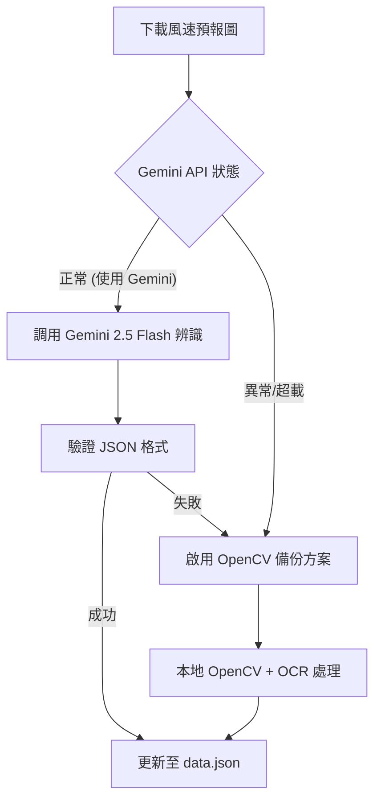

# Gemini 2.5 模型在 LNG 船風力監控系統之應用規劃

本規劃書針對「臺中 LNG 船監控系統」引進 **Google AI Studio** 所產生的免費 **Gemini 2.5 (Flash/Pro) API Key**，詳細說明如何優化現有系統的兩大核心模組：**多模態圖表辨識 (風速預報圖解析)** 與 **智慧化進港決策與風險評估摘要**，並提供測試版（測試環境）的修改方向。

---

## 💡 Gemini 2.5 Flash 核心優勢

在引進模型時，選擇 **Gemini 2.5 Flash** 作為核心引擎具備以下顯著優勢：

1. **超高性價比與免費額度**：
   * Google AI Studio 提供 Gemini 2.5 Flash 高達 **15 RPM (每分鐘請求數)** 與 **1,500 RPD (每日請求數)** 的免費額度。
   * 對於本專案（每日僅需定時更新數次風力預報與船期）而言，運作成本為 **0 元**。

2. **精準的結構化輸出 (Structured Outputs)**：
   * 支援原生 **JSON Schema** 限制，強制模型必須產出完全符合系統預期 Schema 的 JSON，避免傳統 LLM 輸出多餘口語字眼導致 Python 端解析失敗。

3. **強大的視覺理解力 (Multimodal Vision)**：
   * 傳統 OpenCV + OCR 技術對圖表的「網格線粗細」、「曲線顏色」與「網頁改版」極度敏感。Gemini 2.5 Flash 能直接以人類視覺語意來閱讀風速預報圖，辨識率高且抗干擾能力強。

4. **百萬級 Token 上下文窗口 (Context Window)**：
   * 擁有 1M+ Token 窗口，能輕鬆在 Prompt 中傳入多天份的預報曲線數據、多艘船期表、系統安全閥值與港口物理限制，進行跨維度的關聯性推理。

---

## 應用一：多模態圖表辨識（取代傳統 OpenCV + OCR）

### 1. 現有痛點分析
目前系統在 [src/cv2_parser.py](C:/Users/hilla/Desktop/奶昔code/src/cv2_parser.py) 中，使用 OpenCV 進行水平網格線偵測，並利用 Tesseract OCR 辨識時間與風速。
此做法存在以下脆弱點：
1. **網格依賴性高**：若氣象局網站微調預報圖的線條顏色、字型、邊距，網格定位即會錯位。
2. **環境配置複雜**：在部署（例如 Docker 或 GCP Cloud Run）時，必須額外安裝並維護 Linux 系統層級的 `tesseract-ocr` 及其語言包，增加 Container 體積與部署難度。
3. **容錯率低**：若圖表曲線與網格重疊，OCR 常將數字辨識錯誤（例如將 12 誤判為 10）。

### 2. Gemini 2.5 多模態解決方案
Gemini 2.5 具備優秀的視覺理解力，可直接接收圖片輸入，配合 **Structured Outputs (結構化輸出)**，確保回傳完全符合系統 schema 的 JSON 資料。

#### 系統流程圖


#### API 請求設計 (Prompt & JSON Schema)
當調用 API 時，我們傳入風速預報圖，並設定以下 Prompt 與 Schema：

**系統 Prompt：**
> 你是一位高精確度的氣象圖表數據提取助手。請分析這張台中港風速預報圖，精確提取每個時間點的風力預估數據。請忽略背景雜訊，只關注時間（HH:mm）與對應的風速（Knots）。

**預期 JSON Schema：**
```json
{
  "type": "OBJECT",
  "properties": {
    "initial_date": {
      "type": "STRING",
      "description": "預報圖的起始日期，格式為 YYYY-MM-DD"
    },
    "points": {
      "type": "ARRAY",
      "description": "預報點列表",
      "items": {
        "type": "OBJECT",
        "properties": {
          "time": { "type": "STRING", "description": "預報時間，格式為 HH:mm" },
          "cpc_wind_speed": { "type": "NUMBER", "description": "中油預報風速，單位為節 (Knots)" },
          "open_meteo_wind_speed": { "type": "NUMBER", "description": "對照組預報風速，單位為節 (Knots)" }
        },
        "required": ["time", "cpc_wind_speed"]
      }
    }
  },
  "required": ["initial_date", "points"]
}
```

#### Python 整合範例程式碼
使用最新 `google-genai` SDK 實作：

```python
import os
import json
from google import genai
from google.genai import types

def parse_chart_with_gemini(image_path: str) -> dict:
    """
    使用 Gemini 2.5 Flash 解析預報圖
    """
    # 初始化客戶端（會自動尋找環境變數 GEMINI_API_KEY）
    client = genai.Client()
    
    if not os.path.exists(image_path):
        raise FileNotFoundError(f"找不到預報圖檔案：{image_path}")
        
    # 讀取圖片檔案
    with open(image_path, 'rb') as f:
        image_bytes = f.read()
        
    image_part = types.Part.from_bytes(
        data=image_bytes,
        mime_type="image/png"
    )
    
    prompt = (
        "請精確解析這張風速預報圖。提取圖表中 CPC 中油與 Open-Meteo 對應各時間的風速數據。"
        "確保 initial_date 的年份正確（如 2026）。"
    )
    
    # 定義結構化輸出類別
    class WindDataPoint(types.BaseModel):
        time: str
        cpc_wind_speed: float
        open_meteo_wind_speed: float

    class ChartParseResult(types.BaseModel):
        initial_date: str
        points: list[WindDataPoint]

    try:
        response = client.models.generate_content(
            model='gemini-2.5-flash',
            contents=[image_part, prompt],
            config=types.GenerateContentConfig(
                response_mime_type="application/json",
                response_schema=ChartParseResult,
                temperature=0.1 # 低隨機性以提升精確度
            ),
        )
        
        parsed_data = json.loads(response.text)
        print("🎉 Gemini 解析成功！")
        return parsed_data
        
    except Exception as e:
        print(f"❌ Gemini 解析失敗，原因: {e}")
        # 此處可加入 fallback 邏輯調用原有的 parse_chart_with_cv2
        raise e
```

---

## 應用二：智慧化進港決策與風險評估摘要 (含 17:00 前替代窗口與陣風分析)

### 1. 現有痛點與實務調度邏輯
在 LNG 船的實務調度中，決策受限於以下關鍵因素：
1. **季節性預設 POB 時間點**：
   * **夏季**：通常在清晨 **05:00** POB 時間點判斷是否能進港。
   * **冬季**：通常在清晨 **06:00** POB 時間點判斷是否能進港。
2. **夜航物理限制**：LNG 船禁止夜航，船舶進港 (POB) 時間只會落在 **04:00 ~ 17:00** 之間。
3. **安全判斷標準 (以 m/s 為單位)**：
   * **主判斷指標**：採用**空軍預報之平均風速數據**（單位：`m/s`），判斷是否大於安全閥值（如 12 m/s）。
   * **備用參考指標**：**陣風 (Gust) 資料**（單位：`m/s`）作為備用評估數據。
4. **替代窗口掃描機制**：
   * 若預設 POB 時間點（夏季 05:00 / 冬季 06:00）評估為無法進港，系統將啟動掃描。
   * 掃描範圍限制為：**預設 POB 時間點起至當日 17:00 之間**。
   * 若此範圍內無任何符合安全風速的時段，則直接建議該船隻「**調整船期 / 改期**」。

### 2. Gemini 2.5 決策輔助方案
當預設 POB 點風力超標時，系統會彙整當日 **預設 POB 時間點至 17:00** 的空軍平均風速與陣風數據，送給 Gemini 進行時段掃描。

#### Prompt 範本設計
```python
def generate_decision_prompt(ship_name, season, limit_speed_ms, airforce_avg_wind_json, gust_wind_json):
    # 依季節決定預設 POB 點
    default_pob = "05:00" if season == "summer" else "06:00"
    
    prompt = f"""
你是一位資深的台中港口調度長與 LNG 船安全專家。
目前正進行今日的 LNG 船進港評估，請撰寫一段 200 字內、條理清晰的「AI 進港決策與替代窗口建議」。

【基本與物理邊界限制】
- 監控船隻: {ship_name}
- 季節: {'夏季 (預設 05:00 POB)' if season == 'summer' else '冬季 (預設 06:00 POB)'}
- 預設 POB 時間點: {default_pob}
- 船型安全風速限制: {limit_speed_ms} m/s
- LNG 靠泊限制: 禁止夜航，POB 最晚不得超過 17:00

【今日風力預報數據 (範圍: {default_pob} ~ 17:00)】
- 空軍平均風速數據 (單位: m/s, 時間: 平均風速):
{json.dumps(airforce_avg_wind_json, indent=2)}

- 備用陣風 (Gust) 預估數據 (單位: m/s, 時間: 陣風速度):
{json.dumps(gust_wind_json, indent=2)}

【推理與寫作任務】
1. 首先判斷預設 POB 時間點 ({default_pob}) 的空軍平均風速是否符合安全風速限制 (<= {limit_speed_ms} m/s)。
2. 若預設時間點超標，請全面掃描從預設 POB 時間點至當日 17:00 之間的時段：
   - 篩選出「空軍平均風速 <= {limit_speed_ms} m/s」的安全時間窗口。
   - 綜合考量「備用陣風數據」，若某時段平均風力過關但陣風極度偏高，需在建議中加註風險提示。
   - 明確向調度人員推薦可行的「替代進港窗口時間」。
3. 數據防呆邏輯：若預報數據中出現「陣風小於平均風速」的物理異常，應以平均風速作為該點的陣風下限（即 陣風 = max(陣風, 平均風速)）進行評估。
4. 若從 {default_pob} 到 17:00 之間，沒有任何時段符合安全限制，請明確發出警告並強烈建議「今日改期，重新調整船期」。
5. 輸出語氣須專業、果斷、條理分明。
"""
    return prompt
```

#### 生成範例
**輸入數據：**
* 船名: `MILKSHAKE` (180K 級)
* 季節: `冬季` (預設 POB 06:00)
* 安全風速限制: `12.0` m/s
* 06:00 數據: 空軍平均風速 13.5 m/s，陣風 18.0 m/s（不符進港限制）
* 預報資料（06:00 - 17:00）：
  * 06:00 - 10:00 空軍均風 13.0~14.5 m/s，陣風 17~20 m/s (不符)
  * 11:00 - 13:00 空軍均風 12.5 m/s，陣風 16.0 m/s (不符)
  * 14:00 - 16:00 空軍均風 9.5 m/s，陣風 11.5 m/s (符合安全限制)
  * 17:00 空軍均風 13.0 m/s，陣風 17.0 m/s (不符)

**Gemini 生成輸出：**
> ⚠️ **今日進港決策與替代窗口建議**：
> 今日為冬季，預設的 **06:00 POB** 因空軍平均風速達 13.5 m/s，已超過 12 m/s 的安全限制，**判定無法準點進港**。
> 經掃描 06:00 至 17:00 的預報趨勢，下午有明顯轉好窗口：**14:00 - 16:00** 期間空軍均風降至 9.5 m/s，備用陣風亦降至 11.5 m/s，為今日唯一安全進港時段。建議引水人與調度調整 POB 時間至 **14:00 或 15:00**。因 17:00 後受限夜航且風速再度轉強，若無法於該窗口完成進港，則強烈建議**今日改期**。

---

## 🛠️ 測試版（測試環境）修改方向與實作步驟

為了在測試版中安全地驗證此方案，應遵循「隔離與備援」原則，僅在測試節點進行實作。

### 步驟 1：Python 後端（測試版 Pipeline）
1. **加入 API Key 設定**：
   * 在 [config.json](C:/Users/hilla/Desktop/奶昔code/config.json) 中加入 `"GeminiApiKey": "AI_STUDIO_KEY_VALUE"` 或透過環境變數 `GEMINI_API_KEY` 載入。
2. **實作 Fallback 圖像解析**：
   * 在 [src/cv2_parser.py](C:/Users/hilla/Desktop/奶昔code/src/cv2_parser.py) 導入並使用 `parse_chart_with_gemini`。
   * 以 `try...except` 包裝：優先使用 Gemini，若發生 Quota Error 或網路連線異常，印出警告並自動執行原有的 OpenCV 圖形網格分析邏輯。
3. **決策摘要寫入 Firebase**：
   * 於資料融合 [src/data_fusion.py](C:/Users/hilla/Desktop/奶昔code/src/data_fusion.py) 中，在完成資料合併後，調用 `generate_decision_prompt` 生成 AI 進港建議。
   * 將此摘要命名為 `decision_summary` 存入 Firebase RTDB，測試版路徑限制於 `/test/active_status` 中，不可寫入正式版根目錄。

### 步驟 2：GAS 測試版後端修改（[測試版/gs_test.js](C:/Users/hilla/Desktop/奶昔code/測試版/gs_test.js)）
1. **Script Properties 支援**：
   * 於 `ensureTestEnvironment()` 中設置環境參數，確保 Firebase 連線帶有 `/test` 後綴，並包含測試用密鑰。
2. **歸檔功能擴充**：
   * 在每日 23:00 的 `archive` 歸檔函式中，新增欄位（如試算表 M 欄「AI 決策建議」），將 Firebase `/test/active_status/decision_summary` 的內容讀出並寫入 Google Sheets 中，完成歷程紀錄。

### 步驟 3：前端網頁修改（[測試版/index_test.html](C:/Users/hilla/Desktop/奶昔code/測試版/index_test.html)）
1. **新增 AI 助理看板卡片**：
   * 在「目前監控船隻狀態」或「風速警戒面板」下方，新增一個具現代感（如深色科技、玻璃擬物風、微光閃爍邊框動畫）的 `div#aiAssistantCard` 區塊。
2. **動態渲染資料**：
   * 修改 `fetchStatus()` 函式。當從 `/test/active_status` 取得最新 Firebase 狀態時，將其中的 `decision_summary` 即時渲染至網頁卡片中.
   * 若 Firebase 回傳中無此欄位，則預設顯示：「*AI 決策助理正在評估最佳進港窗口與風速變化...*」。

---

## 🚀 建置與部署指南

### 第一步：申請與設定 API Key
1. 前往 [Google AI Studio](https://aistudio.google.com/)。
2. 點擊 **Create API Key**，並建立一個新 Key。
3. 將產生的 Key 設定於環境變數中：
   * **本機測試**：在環境變數中設定 `GEMINI_API_KEY="你的金鑰"`。
   * **GitHub Actions**：於 GitHub 專案 Settings -> Secrets and variables -> Actions 中新增一個 Secret，名稱為 `GEMINI_API_KEY`。

### 第二步：修改 GitHub Workflow
在 [.github/workflows/update_forecast.yml](C:/Users/hilla/Desktop/奶昔code/.github/workflows/update_forecast.yml) 中，將 `GEMINI_API_KEY` 傳遞給 Python 環境：

```yaml
    - name: Run Pipeline
      env:
        GEMINI_API_KEY: ${{ secrets.GEMINI_API_KEY }}
      run: |
        python main.py
```

### 第三步：安裝 SDK 依賴
更新 [requirements.txt](C:/Users/hilla/Desktop/奶昔code/requirements.txt) 加入最新的官方 SDK：
```text
google-genai>=0.1.1
```
*(原有的 `pytesseract` 與 `opencv-python-headless` 可保留作為備用 Fallback 方案之依賴)*
