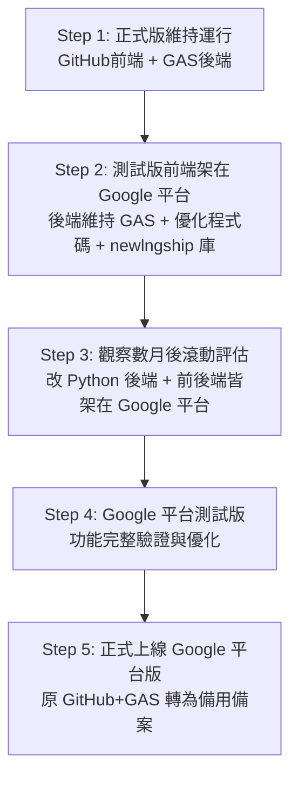

# 🚢 臺中 LNG 船監控系統 — 移轉規劃書 (測試版至 Google 平台)

**規劃時間：** 2026-06-19  
**專案狀態：** 滾動式調整 (優先執行 Step 2 討論與優化，Step 3~5 視觀察情況調整)  
**測試版 Firebase 專案：** `newlngship`  
**測試版金鑰路徑：** `奶昔code/測試版/service_account.json`

---

## 📅 移轉五大步驟 (滾動調整策略)

為解決現行「GitHub 前端 + GAS 後端」跨平台造成的資訊傳遞延遲與接口配置繁瑣問題，並兼顧系統穩定性與風險控管，我們調整為以下五步走策略：

### 📋 步驟詳細說明

* **Step 1：正式版繼續運行（維持現狀）**
  * 正式版保持「GitHub Pages 前端 + GAS 後端」架構，不受測試版移轉影響，確保日常監控業務 100% 穩定。

* **Step 2：測試版前端架設於 Google 平台，後端維持 GAS（目前優先執行）**
  * **前端部署**：將測試版前端（`index_test.html` 等）部署至 **Firebase Hosting**，享有同平台高速傳輸。
  * **後端運行**：後端維持在 GAS 運作，但需將資料庫對接到新建的 **`newlngship`** Firebase 專案。
  * **程式碼優化**：優先修復 [test_code_review_report.md](file:///C:/Users/hilla/Desktop/奶昔code/docs/test_code_review_report.md) 中指出的 5 個 Critical 問題及主要 Important 問題（如 `const pobTime` 崩潰、同步反向遍歷、Firebase /test 環境防護等）。
  * **設定檔更新**：使用置於 `測試版/service_account.json` 的金鑰進行相關設定。
  * **📋 討論與架構決策紀錄**：
    * **前端託管方案**：決定採用 **Firebase Hosting**。部署時，會將 `index_test.html` 複製並命名為 `public/index.html` 進行發布，以符合 Firebase 預設首頁結構，直接用專案網址即可開啟。
    * **後端 GAS 認證**：維持使用 **Database Secret 密鑰**（Legacy Secret）方式。在 Firebase 控制台的 `newlngship` 專案中產生 Database Secret，並填入 GAS 的 Script Properties 的 `FIREBASE_SECRET` 中。此做法可避免在 GAS 中撰寫複雜的 OAuth2 與 JWT 簽署邏輯，將改動降至最低，維持運作穩定。
    * **E2E 測試與 Python 認證**：E2E 測試腳本 `run_auto_test.py` 與 `check_db.py` 決定採用 **「讀取 service_account.json」動態獲取權杖** 方案。使用 Python 認證庫載入 `service_account.json` 以動態生成 OAuth2 Bearer Token，保障金鑰安全性，不再於測試程式碼中寫死任何密碼密鑰。

* **Step 3：觀察期與 Python 化評估（觀察數月後評估）**
  * 觀察測試版在 Google 平台（前端 Firebase Hosting + 後端 GAS）運行數月之穩定度。
  * 評估是否將後端 GAS 程式碼以 Python 重寫，並將 Python 後端架設在 Google 平台（如 **GCP Cloud Run**）。

* **Step 4：Google 平台版完整驗證**
  * 執行完整的 E2E 自動化測試，驗證前後端皆在 Google 平台下的運作狀況，確保排程、爬蟲、時光機與 LINE Webhook 皆正常。

* **Step 5：正式切換與備案啟用**
  * 將正式版遷移至 Google 平台。
  * 原「GitHub 前端 + GAS 後端」版本保留作為緊急災備方案（備案），一旦 Google 平台發生異常可即時切回。

---

## 💰 費用分析 (GCP Serverless 估算)

由於本系統屬於**低頻率、低資料量、定時觸發**的監控系統，若採用 Google Cloud 服務，基本上皆能落在**免費額度（Spark 方案 / GCP Free Tier）**內，預估月維護成本極低。

### 📊 費用對比表 (美金計價)

| GCP 服務項目 | Step 2 (前端 Google, 後端 GAS) | Step 3~5 (前後端均在 Google, 後端 Python) | 估算基礎與免費額度 |
| :--- | :---: | :---: | :--- |
| **Firebase Hosting** (前端網頁託管) | **$0.00** | **$0.00** | * **Spark 方案免費額度**：10 GB 儲存空間，10 GB/月下載流量。 * 測試版前端檔案約 1MB，流量極低。 |
| **Firebase Realtime DB** (`newlngship` 資料庫) | **$0.00 ~ $2.00** | **$0.00 ~ $2.00** | * **Spark 方案免費額度**：1 GB 儲存，10 GB/月下載流量。 * 每分鐘風速監聽與讀寫若長期掛機可能超出，Blaze 方案超額每 GB 下載僅收 $1.00。 |
| **Google Apps Script** (後端 API/排程/歸檔) | **$0.00** | 不適用 (已移轉) | * 完全免費，由 Google 帳號配額提供。 |
| **GCP Cloud Run** (Python 後端託管) | 不適用 (仍用 GAS) | **$0.00 ~ $1.00** | * **GCP Free Tier**：每月 200 萬次請求、180,000 vCPU-秒、360,000 GiB-秒免費。 * 每分鐘爬蟲執行 3 秒 (單核/512MB)，每月僅耗約 13 萬 vCPU-秒。無請求時縮減至 0，不計費。 |
| **GCP Cloud Scheduler** (定時觸發爬蟲) | 不適用 (仍用 GAS) | **$0.00** | * 每個帳戶前 3 個 Cron Job 免費（我們僅需 1~2 個）。 |
| **GCP Secret Manager** (金鑰與憑證管理) | **$0.00** | **$0.00** | * 前 6 個作用中金鑰版本免費（僅需存放 Firebase & LINE Token）。 |
| **合計預估月費** | **$0.00 ~ $2.00 / 月** (近乎完全免費) | **$0.00 ~ $3.00 / 月** (極低成本運行) | **Blaze 方案（按量付費）防穿透防線**：即使因高頻調研稍微超出免費額度，月帳單預估也不會超過 $3 美元。 |

---

## 🛠️ Step 2 程式碼優化重點 (參考 Review 報告)

在維持 GAS 後端運作的同時，應針對 `測試版/gs_test.js` 與 `測試版/index_test.html` 進行以下修正，以確保測試環境的穩定：

1. **修復 C1 (`pobTime` 重新賦值崩潰)**：將 `const pobTime` 改為 `let pobTime`，避免 LINE Webhook 處理無冒號時間時直接崩潰。
2. **修復 C2 (同步 test_monitor 反向遍歷)**：將 `test_monitor/gs_test.js` 中的反向 `for` 遍歷同步回 `gs_test.js`，避免 index jump bug。
3. **修復 C3 (歸檔刪除邏輯移入保護區)**：確保 Firebase 記錄的刪除動作只在 Google Sheets 歸檔成功後執行，防範資料丟失。
4. **修復 C5 (測試前端路徑隔離)**：將 `index_test.html` 的 Firebase DB URL 加上 `/test` 後綴，避免測試端讀寫正式環境資料。
5. **優化 I1 (HTTP 方法大寫)**：將 `UrlFetchApp.fetch` 的 `method: "post"` 改為 `"POST"`，防止退化為 GET。
6. **優化 I3 (觸發器環境驗證)**：在 `checkDailySchedule` 與 `executeMonitor` 加入測試環境的 path 防護，防污染。
