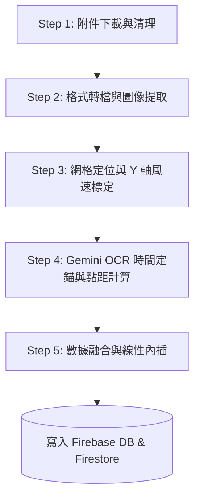

# 中油風力預估管線：風力預測工作流運作程序

本文件詳細記錄了「中油風力預估管線」如何從 Gmail 下載中油天氣圖表、透過 OpenCV 與 Gemini 2.5 Flash 進行精準圖像辨識，並將資料進行數據融合後寫入資料庫的完整運作程序。

---

## 🔄 1. 風力預測 5 大核心步驟

整個自動化管線（Pipeline）每次執行時都會依序執行以下 5 個步驟：



### 📋 Step 1: 附件下載與清理
* **信件搜尋**：後端程式透過 Gmail IMAP 協定連線至收件匣，以當天日期（格式如 `0702`）作為關鍵字，搜尋主旨為 `中油0702` 且來自 `weather.center@msa.hinet.net` 的氣象郵件。
* **下載儲存**：將信件中夾帶的原始 Word 格式預報附件（如 `0702中油.doc`）下載並儲存至臨時目錄。

### 📋 Step 2: 格式轉檔與圖像提取
* **LibreOffice 轉檔**：在 Linux/GCP Cloud Run 容器環境下，呼叫 **LibreOffice 無頭模式 (Headless Mode)** 將舊版 `.doc` 檔案轉換為結構化的 `.docx` 壓縮檔：
  ```bash
  libreoffice --headless --convert-to docx /app/0702中油.doc --outdir /app/temp
  ```
* **圖片提取**：利用 Python 解壓縮並讀取 `.docx` 中的內部媒體資料夾，精確抽取出圖表圖片 `word/media/image1.png` 作為 OpenCV 分析的目標。

### 📋 Step 3: 網格定位與 Y 軸風速標定
* **橫線偵測**：利用 OpenCV 對圖片進行二值化處理，並套用水平形態學核（Horizontal Kernel）過濾出圖表中的橫向網格線。
* **標定風速範圍**：
  * 最頂端網格線的 Y 像素座標代表 **`50 KT`**（如 $Y=32$）。
  * 最底端網格線的 Y 像素座標代表 **`0 KT`**（如 $Y=442$）。
  * **幾何變換**：此後，折線上任何點的 Y 軸座標，皆可透過線性插值換算為真實的風速值：
    $$\text{風速 (KT)} = 50 \times \left(1 - \frac{Y - Y_{\text{top}}}{Y_{\text{bottom}} - Y_{\text{top}}}\right)$$

### 📋 Step 4: Gemini OCR 時間定錨與點距計算
* **時間定錨 (00Z/12Z 的作用)**：
  * 空軍預報圖的橫軸只寫著 `1`, `2`, `3`, `4`, `5` 這種日期（天數），並未標示具體小時。折線圖的第一個起點像素，代表的正是預報開始的「初始時間 (Initial Field)」。
  * 系統呼叫 **Gemini 2.5 Flash REST API** 讀取圖片右上角的初始時間標記。
  * **00Z 辨識**：若識別為 `00Z01JUL`，代表世界協調時間 (UTC) 00:00，轉換為台灣時間 (CST) 即為 **7/1 08:00**。折線起點隨之對齊為 **`7/1 08:00`**。
  * **12Z 辨識**：若識別為 `12Z01JUL`，代表世界協調時間 (UTC) 12:00，轉換為台灣時間即為 **7/1 20:00**。折線起點隨之對齊為 **`7/1 20:00`**。
  * *若右上角時間解析錯誤，將直接導致整條折線的時間軸產生 12 小時的整體偏移。*

* **點距計算 (dx)**：
  * 系統偵測出紅色折線的起點 X 座標 ($X_{\text{min}}$) 與終點 X 座標 ($X_{\text{max}}$)，計算出紅色折線在圖片中的**總寬度（像素）**。
  * 透過 **自相關演算法 (Autocorrelation)**（詳見下方說明），動態推算這張圖是屬於 **23 點格式**（6天預報）還是 **33 點格式**（9天預報）。
  * 以 23 點格式為例，共有 22 個間隔，精確點距為：
    $$\text{精確間距 (dx)} = \frac{X_{\text{max}} - X_{\text{min}}}{22}$$

### 📋 Step 5: 數據融合與線性內插
* **補足 1 小時數據**：空軍折線圖的點是 **6 小時一筆**。為了與 Open-Meteo 氣象 API 的 **1 小時一筆**預報數據在同一個 ECharts 時間軸上進行比對，`data_fusion.py` 會使用**線性插值法**，補足中間空缺的小時（例如：08:00 是 2KT，14:00 是 8KT，則線性補足 09:00 為 3KT、10:00 為 4KT...）。
* **Open-Meteo 串接**：同時發送請求至 Open-Meteo API，拉取相同時間區間的 1 小時陣風數據。
* **資料庫寫入**：將兩組對齊好時間的 1 小時一筆風速數據進行融合，加上特定的風速比例係數後，寫入 Firebase Realtime Database 與 Google Cloud Firestore。

---

## 📊 2. 核心技術：自相關演算法計算 dx

程式如何從圖片中動態算出 24 小時大格對應的 `32 像素`（或幾何計算值 `31.73 像素`）？

### 2.1 訊號提取與去均值
1. 程式會沿著 X 軸，逐一計算每一行（X 位置）中紅色像素點的個數，得到折線的「垂直厚度序列」。
2. 由於折線的轉折處或圓點點標處會比較厚，這會形成一條上下起伏的**週期性波動訊號**。
3. 將此訊號減去平均值，使其在 $0$ 電平上下波動，以利計算。

### 2.2 自相關計算公式
程式將該訊號複製一份並向右移動（Lag 偏移量），計算兩份訊號在不同 Lag 偏移量下的乘積總和。
* 當偏移量正好等於「相鄰兩個預報點（6小時）」的像素距離時，兩者的波峰會重合，相乘後會產生一個**自相關最大值（Peak）**。
* 程式在合理範圍（$15 \sim 45\text{ 像素}$）內尋找這個最大值：
  $$\text{dx\_peak} = \operatorname{argmax}_{\text{lag} \in [15, 45]} \text{Autocorr}(\text{lag})$$
* 在 `0702` 這張氣象圖中，自相關波峰測得的值為 **`32 像素`**。

### 2.3 幾何平差與點數判定
雖然自相關算出間距粗估為 `32`，但為了克服圖像壓縮失真，系統會结合**折線總寬度**進行校正：
1. 本次偵測折線範圍從 $X=81$ 到 $X=779$，總寬度為 $698\text{ 像素}$。
2. 預測點數公式：
   $$\text{估計點數} = \frac{\text{總寬度}}{\text{自相關間距}} + 1 = \frac{698}{32} + 1 \approx 22.8\text{ 點}$$
3. 由於空軍規格僅有 **23 點**（6天版）與 **33 點**（9天版）兩種，系統將 $22.8$ 自動捨入為最接近的 **`23 點`**。
4. 精確幾何間距重新修正為：
   $$\text{dx} = \frac{698}{23 - 1} \approx \mathbf{31.73\text{ 像素}}$$
